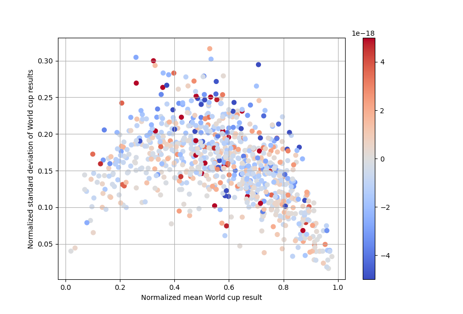
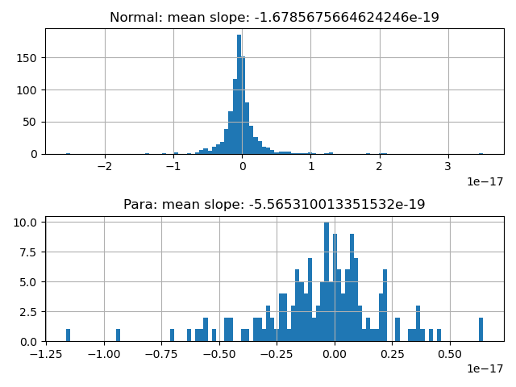

# Analysis of IFSC Climbing World Cup and Paraclimbing World Cup results 

I was wondering if the results of para-climbing and regular world cups show different patters. 

- Are the results mostly random and what is the ratio between luck and skill?
- Are there outstanding athletes that dominate the sport in both branches? 

## Methods

I downloaded the IFSC World cup results using web-scraping with python and selenium, see "ifsc_scrape_athletes2.py". This gave me a .csv table with competition name, date, rank and category for each athlete. This dataset can be found in "athlete_rankings.zip"

I calculated the normalized rank for each competition:

```
normalized rank = rank / number of competitors in class
```

where 0 means becoming first and 1 becoming last. 

I selected athletes that have results from more than 4 World Cups or Championships since the year 2000 and calculated the mean  normalized rank and the standard deviation of the normalized rank. In addition I fitted a linear regression to the normalized rank over time, where a value near 0 indicates little change over time, a negative slope means the athlete is improving their ranking towards first place and a positive slope means the athlete is trending towards last place. 

## Results

Here you can see a comparison of regular and paraclimbing world cup results, where the athletes on the left are the best and on the right are the worst. The vertical axis shoes how much their results vary.


The first thing we notice is that the pattern for regular and paraclimbing looks almost identical, a "c" or banana shape. This banana shape means that both the over- and under-achievers (left and right) have much more consistent world cup results than the bulk of climber in the middle. If we zoom into the lower left you find exception athlete that almost always win their competition. For the regular athletes, this place is occupied by Janja Garnbret (no suprise)and Chaehyun Seo, in the para world Thierry Delarue,  Romain Pagnoux and Solenne Piret show similar performance. 

My results are in the middle field, where you can find much larger variation in results than at the top level (on the left) . This indicates that randomness has a larger role to play for climber that belong to the 20-80% best climbers.  

Does this increase in standard deviation for the middle field come from improving ranking over time? To check this I added slope to the figure . Here the figure for regular world cups, where color indicates athlete improvement (blue), little change (gray) and declining performance (red). 



We can see only a very weak relationship between standard deviation and slope. Most of the banana shape is not just a result of athlete improvement, since the gray and red dots also follow the banana shape.  

So what does this tell us?

- There is no easy way to the top. Luck plays the biggest role for the top 20-80% of athletes, less so for the top and bottom 20%. Expect variable competition results unless you are really good or really bad, it's part of the game.
- In some categories there are exceptionally talented athletes that dominate the field. Don't compare yourself to them, keep on training and you'll get there. Also have fun!
- Para-climbing is an elite level sport that shows identical statistical patterns to regular competition climbing.

A curious finding is that the rate of athlete improvement over time (avg. slope) is over 8 times higher for para-climbing than regular world cups. I wonder if this is a statistical artifact due to the smaller sample size, or a real effect, since many para climbers start competing at the world cups compared to regular climbers that often have previous competition experience. 



## Acknowledgements 

You are all amazing climbers and humans no matter the competition ranking! Also regular or normal climbers is a dumb term but I can't think of a better one right now. Thanks to the IFSC for hosting World Cups and a nice results website. 

All code and tables can be found in this repository.